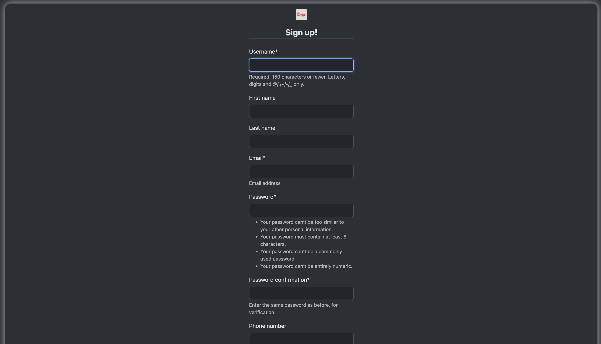
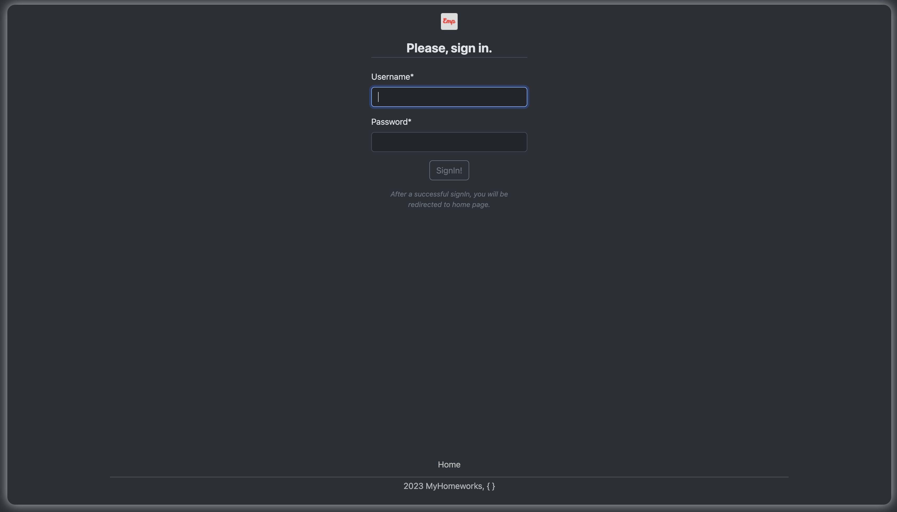
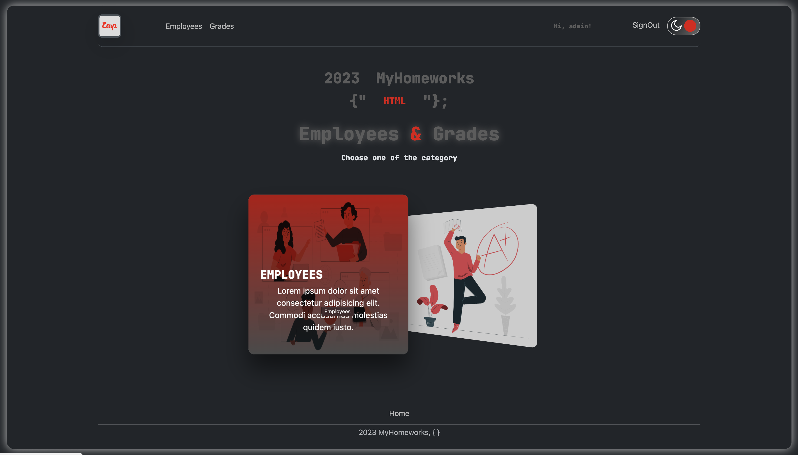
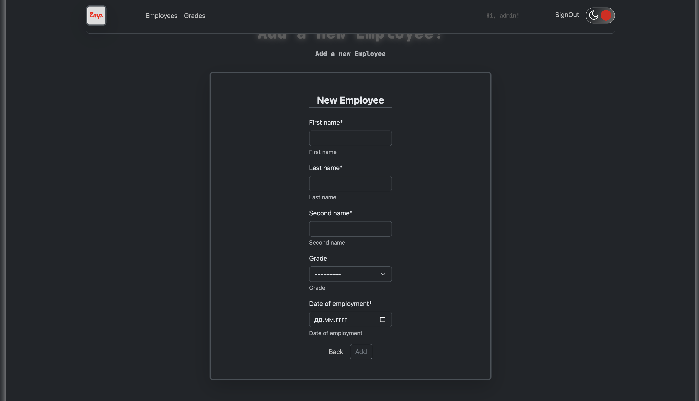
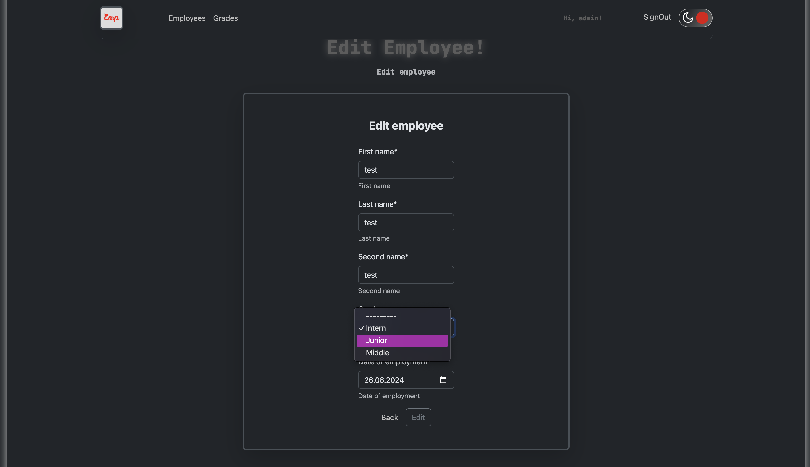
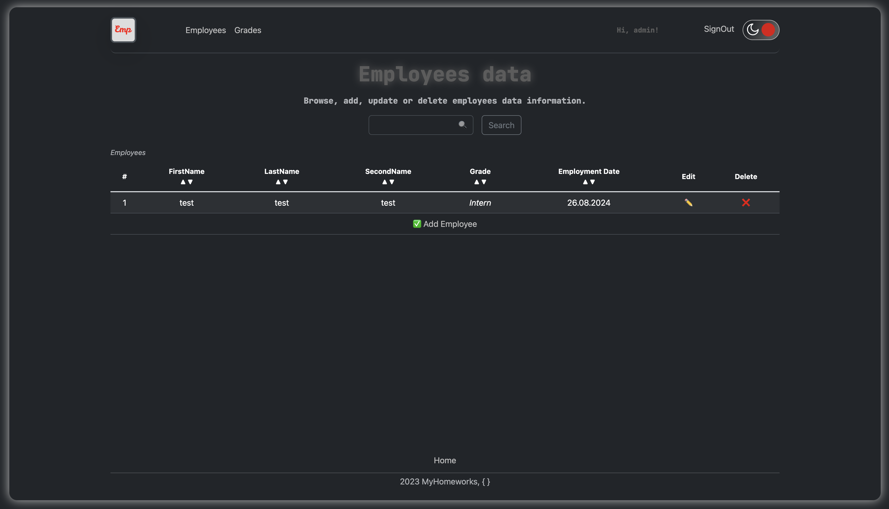

## Description
This is a Django test project using MySQL and Docker.


## Launch instructions


1. Clone repository to your local folder;
2. Copy dev.env to .env file: ```cp dev.env .env```;
3. Open and follow the instructions in the new created .env file;
4. For this step you should already have installed Docker and docker-compose on your PC:
- make sure You are in project folder: ```cd '.../project_folder' ```;
- Run docker-compose: ```docker-compose up --build```;
- Installation can take some time, it depends on your PC resources;
- After the installation is completed, the server will start automatically on 0.0.0.0:8900;
- Open app using http://0.0.0.0:8900/ in your browser;
5. The superuser has been already created;
- You can login under current superuser using standart credentials: ```login: admin; pass: 12345admin```;
- For password change use: ```cd '.../project_folder' && python3 manage.py changepassword admin```
- Or You can manually create superuser for Your own purpose: ```cd '.../project_folder' && python3 manage.py createsuperuser``` ;
6. Note that DataBase - MySQL;
7. To stop the server: ```Ctrl+C```;
8. To completely remove all created docker containers, images and volumes: ```docker-compose down --volumes```.

### Screenshots 

1. Main page (desktop/phone)
<div align="center">
  
</div>


2. Select part (desktop/phone)



3. Data display


4. Data edit


5. Empty data


6. Add data
